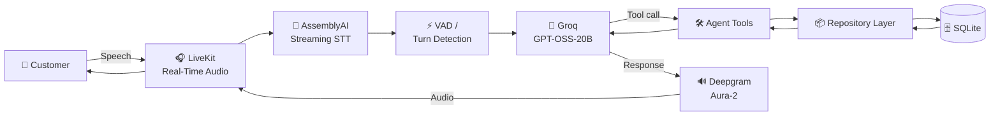
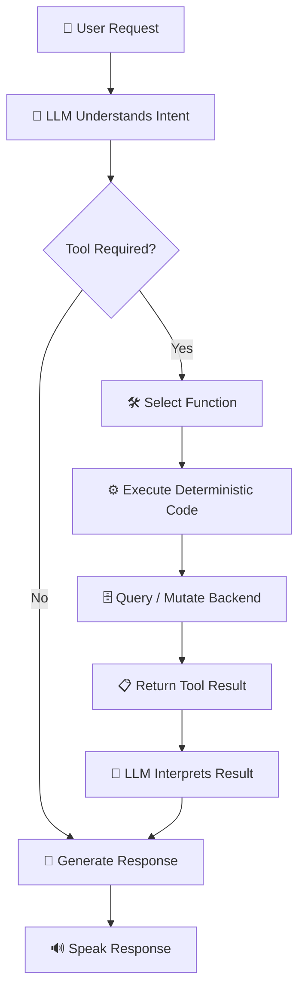
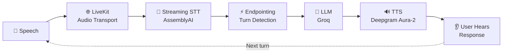
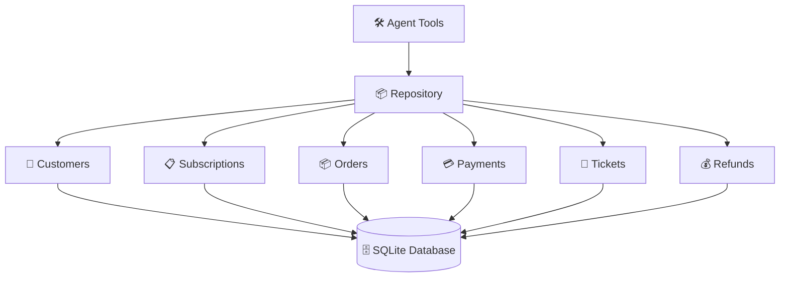
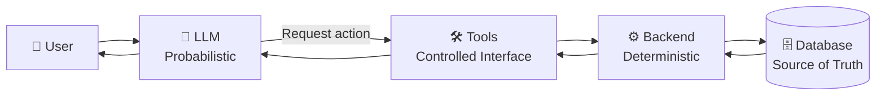

<div align="center">

# 🎙️ Nova — Customer Support Voice Agent

### Real-time voice AI for customer support, powered by LiveKit, AssemblyAI, Groq & Deepgram

<p>
  <strong>Speech → Reasoning → Tools → Backend → Response</strong>
</p>

<br/>


<br/>


</div>

---

## 🧠 What is Nova?

**Nova** is a real-time customer-support voice agent designed to explore the engineering behind production-oriented Voice AI systems.

Instead of building a chatbot that simply generates text, Nova connects:

- 🎤 real-time audio transport
- 📝 streaming speech recognition
- 🧠 LLM-based reasoning
- 🛠️ function/tool calling
- 🗄️ deterministic backend operations
- 💾 persistent relational storage
- 🔊 neural text-to-speech

The result is a complete conversational loop:

```text
Customer speaks
      │
      ▼
┌───────────────────┐
│   LiveKit Audio   │
└─────────┬─────────┘
          │
          ▼
┌───────────────────┐
│  AssemblyAI STT   │
│  Speech → Text    │
└─────────┬─────────┘
          │
          ▼
┌───────────────────┐
│     Groq LLM      │
│ Reasoning + Tools │
└─────────┬─────────┘
          │
          ├───────────────┐
          │               │
          ▼               ▼
   Normal response    Tool call
                          │
                          ▼
                  ┌───────────────┐
                  │ Application   │
                  │    Tools      │
                  └───────┬───────┘
                          │
                          ▼
                  ┌───────────────┐
                  │  Repository   │
                  │     Layer     │
                  └───────┬───────┘
                          │
                          ▼
                  ┌───────────────┐
                  │    SQLite     │
                  │   Database    │
                  └───────┬───────┘
                          │
                          ▼
                    Tool result
                          │
                          ▼
                    ┌──────────┐
                    │   LLM    │
                    └────┬─────┘
                         │
                         ▼
                  ┌───────────────┐
                  │ Deepgram      │
                  │ Aura-2 TTS    │
                  └───────┬───────┘
                          │
                          ▼
                   🔊 Customer
```

---

# 🏗️ Architecture

## High-Level System Architecture



---

## 🔄 Agent Decision Loop

Nova follows a simple but important agentic execution model:



### Core architectural principle

> **The LLM decides what should happen.  
> Application code decides how it happens.  
> The database decides what is actually true.**

This separation is fundamental to building reliable agentic systems.

---

# 🎙️ Voice Pipeline

The voice pipeline is optimized around the constraints of conversational interfaces.



The architecture intentionally keeps the components modular so individual stages can later be benchmarked and optimized independently.

---

# 🛠️ Tech Stack

<table>
<tr>
<td align="center" width="140">

### 🐍
**Python**

</td>

<td align="center" width="140">

### 🎧
**LiveKit**

</td>

<td align="center" width="140">

### 📝
**AssemblyAI**

</td>

<td align="center" width="140">

### 🧠
**Groq**

</td>

<td align="center" width="140">

### 🔊
**Deepgram**

</td>

<td align="center" width="140">

### 🗄️
**SQLite**

</td>
</tr>
</table>

### Runtime & Voice Infrastructure

| Technology | Responsibility |
|---|---|
| 🐍 **Python** | Application runtime |
| 🎧 **LiveKit Agents** | Real-time agent orchestration |
| 🌐 **LiveKit** | Real-time audio transport |
| 📝 **AssemblyAI** | Streaming speech-to-text |
| 🧠 **Groq** | Low-latency LLM inference |
| 🔊 **Deepgram Aura-2** | Neural text-to-speech |
| 🗄️ **SQLite** | Persistent relational storage |
| 🔐 **python-dotenv** | Local environment configuration |

### Models

```text
┌─────────────────────────────────────────────┐
│                  NOVA AI                    │
├─────────────────────────────────────────────┤
│                                             │
│  🎤 Speech Recognition                      │
│       └── AssemblyAI Streaming STT          │
│                                             │
│  🧠 Reasoning                               │
│       └── openai/gpt-oss-20b via Groq       │
│                                             │
│  🔊 Speech Synthesis                        │
│       └── Deepgram Aura-2                   │
│                                             │
└─────────────────────────────────────────────┘
```

---

# 🧩 Agent Capabilities

Nova currently exposes six backend operations to the LLM:

| Tool | Purpose |
|---|---|
| 🔎 `check_customer()` | Identify a customer using email |
| 📋 `get_subscription()` | Retrieve subscription information |
| 📦 `get_order_status()` | Retrieve order status |
| 💳 `check_payment()` | Retrieve payment information |
| 🎫 `create_support_ticket()` | Create a support ticket |
| 💰 `request_refund()` | Request a refund for a payment |

The LLM does **not** directly access SQLite.

Instead:

```text
LLM
 │
 │ function call
 ▼
Agent Tool
 │
 ▼
Repository
 │
 ▼
SQLite
```

This creates a clean boundary between probabilistic reasoning and deterministic application behavior.

---

# 🗄️ Backend Architecture



---

# 🧱 Data Model

```text
                    ┌───────────────┐
                    │   Customers   │
                    └───────┬───────┘
                            │
              ┌─────────────┼──────────────┐
              │             │              │
              ▼             ▼              ▼
      ┌──────────────┐ ┌───────────┐ ┌─────────────┐
      │Subscriptions │ │  Orders   │ │  Payments   │
      └──────────────┘ └───────────┘ └──────┬──────┘
                                             │
                                             ▼
                                      ┌─────────────┐
                                      │   Refunds   │
                                      └─────────────┘

                    Customers
                        │
                        ▼
                ┌───────────────┐
                │ Support Ticket│
                └───────────────┘
```

The current database contains:

- `customers`
- `subscriptions`
- `orders`
- `payments`
- `tickets`
- `refunds`

Foreign keys enforce relationships between these entities.

---

# 🎯 Voice-Aware Engineering

One of the less obvious problems in Voice AI is that identifiers designed for visual interfaces are not necessarily speech-friendly.

For example, a user might say:

```text
"Order zero zero zero one"
```

while the speech recognizer might produce:

```text
"order 0001"
```

or:

```text
"order zero zero zero one"
```

The application normalizes these representations into a canonical identifier:

```text
ORD-0001
```

Similarly:

```text
"payment seven zero zero two"
```

can resolve to:

```text
PAY-7002
```

### Why this matters

Voice interfaces require a different input-normalization strategy from traditional web forms.

```text
Web UI

ORD-0001
     │
     ▼
Exact string
     │
     ▼
Backend


Voice UI

"order zero zero zero one"
          │
          ▼
       ASR output
          │
          ▼
Normalization
          │
          ▼
     ORD-0001
          │
          ▼
       Backend
```

This normalization layer is deliberately kept outside the LLM so that identifier resolution remains deterministic.

---

# 🧠 Conversational Guardrails

Nova's system instructions establish several behavioral constraints.

### Reliability

The agent must not:

- invent customer information
- fabricate payment information
- fabricate order information
- claim an operation succeeded without tool confirmation

### Tool discipline

Backend operations are performed through tools rather than generated text.

For example:

```text
❌ LLM:
"Your refund has been processed."

without executing a refund operation.

✅ LLM:
Tool → request_refund()
      ↓
Backend result
      ↓
LLM response
      ↓
"Your refund request has been created."
```

### Voice UX

Responses are intentionally optimized for speech:

- concise answers
- conversational language
- one question at a time
- minimal unnecessary detail
- no visual-interface assumptions

---

# 🔬 Interesting Engineering Techniques

### 🧠 Tool-Augmented Generation

The LLM is augmented with deterministic application functions rather than being treated as an autonomous source of truth.

### 🔌 Separation of Concerns

The project separates:

```text
Conversation
     ↓
Agent
     ↓
Tools
     ↓
Repository
     ↓
Database
```

Each layer has a well-defined responsibility.

### 📦 Repository Pattern

Database operations are isolated from the agent implementation.

This makes it possible to migrate from:

```text
SQLite
```

to something like:

```text
PostgreSQL
```

without coupling SQL operations directly to the voice-agent layer.

### 🎤 Speech-Aware Input Normalization

Identifiers are normalized for speech-recognition failure modes rather than assuming exact textual input.

### ⚡ Low-Latency Inference

The architecture uses a low-latency LLM inference provider because conversational systems are highly sensitive to response latency.

### 🔄 Multi-Stage Inference Pipeline

The complete response is generated through multiple asynchronous stages:

```text
Audio
 ↓
STT
 ↓
LLM
 ↓
Tool
 ↓
Database
 ↓
LLM
 ↓
TTS
 ↓
Audio
```

This makes latency additive across the pipeline and provides a useful foundation for future latency profiling.

---

# 📁 Project Structure

```text
customer-support-voice-agent/
│
├── app/
│   ├── agent.py
│   ├── main.py
│   └── tools.py
│
├── backend/
│   ├── database.py
│   ├── models.py
│   ├── repository.py
│   └── seed.py
│
├── data/
│
├── .env
├── .gitignore
└── README.md
```

### `app/`

The real-time agent/application layer.

[`app/agent.py`](app/agent.py) defines Nova's conversational behavior, system instructions, and available tools.

[`app/main.py`](app/main.py) initializes the LiveKit agent session and wires together STT, LLM, and TTS.

[`app/tools.py`](app/tools.py) exposes customer-support operations to the LLM.

### `backend/`

The deterministic business/data layer.

[`backend/database.py`](backend/database.py) handles SQLite connection and database-path configuration.

[`backend/models.py`](backend/models.py) defines the relational schema.

[`backend/repository.py`](backend/repository.py) encapsulates database access.

[`backend/seed.py`](backend/seed.py) creates and populates development data.

### `data/`

Contains the local SQLite database used by the development backend.

---

# 🔐 Trust Boundaries

A particularly important design goal is maintaining clear trust boundaries.



The model can **request** an operation, but it cannot independently establish that the operation happened.

The backend response is authoritative.

---

# 🚀 Development Roadmap

The project is being developed incrementally to explore the engineering problems behind modern Voice AI agents.

```text
                    NOVA DEVELOPMENT ROADMAP

┌──────────────────────────────────────────────────────────┐
│  01  Conversational Intelligence              ✅         │
├──────────────────────────────────────────────────────────┤
│  02  Function Calling / Agent Tools           ✅         │
├──────────────────────────────────────────────────────────┤
│  03  Real Backend + SQLite                    ✅         │
├──────────────────────────────────────────────────────────┤
│  04  RAG / Knowledge Retrieval                🔜         │
├──────────────────────────────────────────────────────────┤
│  05  Memory                                    🔜         │
├──────────────────────────────────────────────────────────┤
│  06  Voice Engineering                        🔜         │
│      • Barge-in                                            │
│      • Interruption handling                               │
│      • VAD                                                  │
│      • Endpointing                                          │
│      • TTS cancellation                                     │
├──────────────────────────────────────────────────────────┤
│  07  Latency Engineering                      🔜         │
│      • TTFT                                                 │
│      • STT latency                                          │
│      • Tool latency                                         │
│      • TTS latency                                          │
│      • Streaming                                            │
└──────────────────────────────────────────────────────────┘
```

---

# 📚 Technologies & Documentation

- **LiveKit Agents** — real-time voice-agent orchestration
- **LiveKit** — real-time media infrastructure
- **AssemblyAI** — streaming speech recognition
- **Groq** — low-latency LLM inference
- **Deepgram** — speech synthesis
- **SQLite** — embedded relational database
- **Python** — application runtime
- **python-dotenv** — environment configuration

Useful platform/API concepts include:

- Function calling
- Streaming inference
- Speech-to-text
- Text-to-speech
- Voice activity detection
- Turn detection
- Endpointing
- Repository pattern
- Relational data modeling
- Tool-augmented generation
- Stateful agent execution

---

# 🧭 Design Philosophy

Nova intentionally follows a **boring backend + intelligent interface** philosophy.

The AI should handle the parts where probabilistic reasoning is useful:

```text
Intent
  ↓
Reasoning
  ↓
Tool selection
  ↓
Natural language generation
```

The backend should handle the parts where determinism is required:

```text
Validation
  ↓
Authorization
  ↓
Business rules
  ↓
Database mutations
  ↓
Persistent state
```

This distinction becomes increasingly important as an agent moves from a demo toward a production system.

---

# 📈 What This Project Explores

This repository is less about building a generic chatbot and more about understanding the engineering constraints of **real-time AI agents**.

The project provides a foundation for exploring:

```text
                    Voice AI
                       │
        ┌──────────────┼──────────────┐
        │              │              │
        ▼              ▼              ▼
     Speech          Agents          LLMs
        │              │              │
        ▼              ▼              ▼
      STT/TTS       Tools         Reasoning
        │              │              │
        └──────────────┼──────────────┘
                       │
                       ▼
                  Production AI
                       │
          ┌────────────┼────────────┐
          ▼            ▼            ▼
       Memory         RAG        Latency
```

The long-term goal is to evolve the system from a simple conversational prototype into a more production-oriented voice-agent architecture with retrieval, memory, observability, evaluation, guardrails, and latency optimization.

---

<div align="center">

### 🎙️ Nova

**Real-time voice. Deterministic tools. Persistent backend.**

Built to learn how production Voice AI systems actually work.

</div>